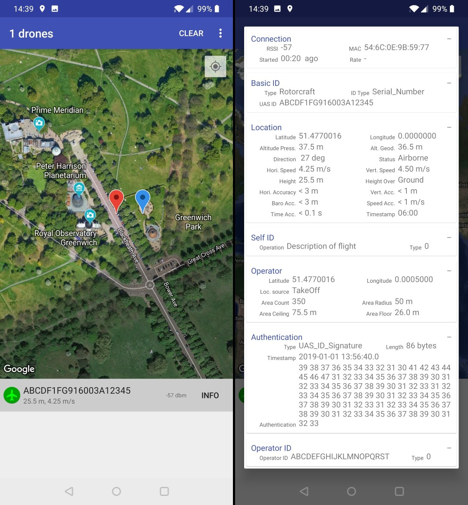

# OpenDroneID Android receiver application

This project provides the source codes for an example receiver implementation for OpenDroneID Bluetooth and WiFi NaN (Neighbor aware Network) signals for Android phones.
The application is compliant with the Bluetooth and WiFi NaN part of the ASTM Remote ID standard available at: https://www.astm.org/Standards/F3411.htm.

Please see the opendroneid-core-c project for more information: https://github.com/opendroneid/opendroneid-core-c

The application continuously scans for Bluetooth advertising/WiFi NaN signals/beacons.
If any is found matching the specifiers for OpenDroneID signals, it adds that beacon to a list, will display the location of the drone on a map and can show the detailed content of the OpenDroneID data.

The red marker on the map shows the location of the drone and the blue marker the location of the operator (if that data field is being received).
A red line will be drawn to show where the drone has been flying.

Please note: The user of this receiver application must always visually verify that the received Open Drone ID signal corresponds to an actual drone seen flying in the air, at the position the signal claims it to be.

To build the application, use Android Studio.
Import the project (File -> New -> Import Project) and point to the folder named Android.
Then Build -> Make Project.

For full functionality, before building the source, you need to obtain a Google Maps API key.
The sources are on purpose not delivered with a key and for the same reason ready built apk files are not provided.
Please generate your own key as detailed here:
https://developers.google.com/maps/documentation/android-sdk/get-api-key

Your own generated key must be inserted in:
`Android/app/src/main/res/values/google_maps_api.xml`

The application has been tested to work on several devices:
- Huawei Y6 Pro (Android 5.1)
- HTC one M9 (Android 5.1, 6.0, 7.0)
- OnePlus 6T (Android 9 and 10)
- Samsung Galaxy S10 (Android 9 and 10)
- Huawei Mate 20 Pro (Android 9)
- HMD Global Nokia 2.2 (Android 9)
- Motorola One Vision (Android 9)
- Xiaomi Mi 9 (Android 9)

The app will read the Android feature flags to determine whether the phone model supports receiving only Legacy Bluetooth advertising signals (BT4) or whether it also supports receiving Long Range + Extended Advertising signals (optional BT5 features).
If both are supported, it will listen for both types simultaneously.

All tested devices receive Bluetooth Legacy advertisements continuously.

For receiving Long Range and Extended Advertising signals, out of the tested devices, only the Samsung Galaxy S10 and the Huawei Mate 20 Pro devices can be recommended.
Both receive the signals continuously.
The S10 seems to have a bit better signal strength reception.

The One Plus 6T and the Xiaomi Mi 9 both receive the signals but some power(?) saving feature or similar in the driver layer cause them to receive the signals for 5 seconds, then pause 15 seconds and this repeats.
This unfortunately makes tracking of Open Drone ID signals rather impractical due to the long pauses.
Both are based on Qualcomm Snapdragon chipsets.
A SW update somewhere in Q4 2020 changed this behavior so the One Plus 6T would listen for 1 second, pause for 4 seconds and repeat.
It might be possible that the driver layer alternate between listening to Coded PHY S=8 and S=2, causing this effect?

The Motorola One Vision and the HMD Global Nokia 2.2 are not recommended.
Both have the Android feature flags for Long Range and Extended Advertising set to true, but in reality they never receive those signals.
There seems to be a clear error in the driver implementations of those devices or maybe they don't listen to the coded PHY on the primary channel but only on the secondary channel?

The rest of the tested phones support receiving only Legacy Advertising signals.

Reception of WiFi NaN signals have been successfully tested on the Samsung Galaxy S10 device.
It should be possible to receive WiFi NaN signals on the following devices, but please be aware that this has not been verified using this OpenDroneID Receiver application:
- Samsung Galaxy S9, S10, S20 (and the various +, note, ultra etc. variants of these)
- Google Pixel 2, 3, 4 (and the various A, XL variants of these)
- Xiaomi Mi 8, 9, Note 10, redmi K20 Pro/CC9 Pro/Note 10 Pro

The values of the feature flags for BT/WiFi are listed in the settings menu of the application.

A more extensive list of the support in different phone models is maintained [here](supported-smartphones.md).

## High level SW Architecture

An auto-generated view of the class structure can be seen in the below figure.

