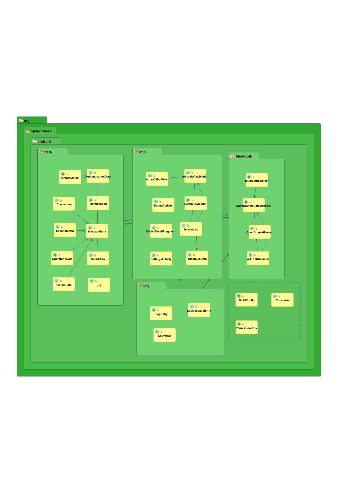

# OpenDroneID Android receiver application

This project provides the source codes for an example receiver implementation for OpenDroneID Bluetooth signals for Android phones.

It continuously scans for Bluetooth advertising signals/beacons and if any is found matching the specifiers for OpenDroneID signals, it adds that beacon to a list, will display the location of the drone on a map and can show the detailed content of the OpenDroneID data.

The red marker on the map shows the location of the drone and the blue marker the location of the operator (if that data field is being received). A red line will be drawn to show where the drone has been flying.

Please note: The user of this receiver application should always visually verify that the received Open Drone ID signal corresponds to an actual drone seen flying in the air at the position the signal claims it to be.

To build the application, use Android Studio. Import the project (File -> New -> Import Project) and point to the folder named Android. Then Build -> Make Project.

For full functionality, before building the source, you need to obtain a Google Maps API key. The sources are on purpose not delivered with a key and for the same reason ready built apk files are not provided. Please generate your own key as detailed here:
https://developers.google.com/maps/documentation/android-sdk/get-api-key

Your own generated key must be inserted in:
`mobiledemo\Android\app\src\main\res\values\google_maps_api.xml`

The application has been tested to work on a few select devices:
- Huawei Y6 Pro (Android 5.1)
- HTC one M9 (Android 5.1)
- OnePlus 6T (Android 9 and 10)
- Samsung Galaxy S10 (Android 9 and 10)
- Huawei Mate 20 Pro (Android 9 and 10)

It will auto-detect whether the phone HW supports receiving only Legacy Bluetooth advertising signals or whether it also supports receiving Long Range + Extended Advertising signals. If both are supported, it will listen for both types simultaneously.

All tested devices receive Legacy advertisements continuously.

The 6T, the S10 and the Mate 20 Pro devices all support receiving Long Range but with varying degrees of success. The 6T is not recommend, since it seems to receive Long Range signals for 5 seconds, then pause 15 seconds and it keeps repeating this cycle (device firmware A6013_41_190911 and A6013_41_191214). This makes tracking OpenDroneID signals purely transmitted as Long Range impractical. Hopefully a future SW update will fix this. The S10 and Mate 20 Pro both receive the Long Range signals continuously.

## High level SW Architecture

An auto-generated view of the class structure can be seen in the below figure.

